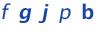
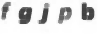
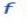
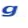
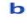
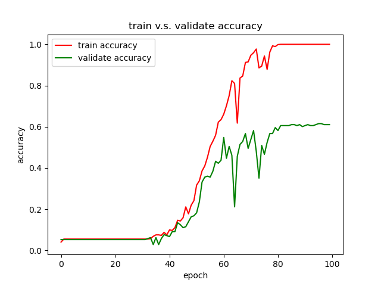

# jAccount Captcha

> - 数据集链接：https://jbox.sjtu.edu.cn/l/k03r28 (密码：eplu)。 数据集中一共下载了1000张验证码图片，并对前250张进行了标注。
>
> - 机器学习小白，如有问题，欢迎指正。
>
> - 欢迎 star, fork, pr 以及 issue。

## 1. 项目简介

解决问题：降低使用jAccount登录网站时需要手动输入验证码的麻烦。

项目流程：

- [x] 数据收集

- [x] 模型训练

- [ ] 服务上线

## 2. 数据收集

### 2.1 数据下载

为了完成验证码的识别任务，我们首先需要下载一定量的数据集。

打开jAccount的登陆界面，查看网页的源代码，我们可以获得验证码图片的 url 。验证码的格式如下，其中 `uuid` 可能为每个用户单独的身份验证信息，`timestamp` 代表着当前时间戳。如果需要自己下载数据集，可以在代码中进行指定。

`https://jaccount.sjtu.edu.cn/jaccount/captcha?uuid=[uuid]&t=[timestamp]`

最后，我们可以直接使用 Python 中的 requests 库直接下载保存验证码图片。

代码实现参考`download_images.py`中。

### 2.2 数据预处理

在下载完图片之后，我们希望对图片进行预处理，以便于后续模型的训练。

首先是对数据进行标注。我们使用的是人工标注的方法，标注了250张图片（标注难免有些错误，欢迎指正）。标注结果存储在`data/labels.csv`文件中。

接着，我们需要对每张图片进行预处理。预处理中主要使用了 Python 的 opencv 库，预处理的最终结果是将一张验证码图片切割为4-5张只含有1个字母的图片。

预处理的流程大致如下：

1. 读取图片。

   

2. 图片灰度化、中值滤波降噪、腐蚀操作，得到的结果如下所示。

   

3. 为了更好的切割字母，因此我们对图片进行数值和水平描，尽量切除不必要的空白。

4. 根据字母的个数对验证码图片进行切割、填充至目标大小。如下所示，上面展示的验证码图片被我们分割成下面五张大小为3x32x32的图片。

   

   

   

   

   

5. 此外，为了简化训练模型时图片的预处理，对于上一步的彩色图片，我们增添了一组灰色图片训练集。

代码实现参考`process_images.py`中。

## 3. 模型训练

完整的机器学习模型训练流程主要包含以下五个要素：

- 数据：训练机器学习的基础，通常包括上面的数据收集、数据预处理、特征选择等步骤。在我们的验证码识别项目中，我们选取的特征是一张图片上的所有像素点的值。
- 模型：常用的模型有较简单的`LeNet` `AlexNet`，复杂的`ResNet` `GoogleNet`等。目前，我们的项目中实现的是`LeNet`和`ResNet`。
- 优化器：优化模型参数的方式，常用的有`SGD`, `Adam`, `RMSprop`等。
- 损失函数：计算模型计算的值和目标值之间的“距离”。对于多分类问题，我们选取的损失函数通常是交叉熵损失`CrossEntropyLoss`。
- 迭代训练：综合上述四点要素对模型进行迭代训练，更新模型的参数直至模型得到较高的准确率。

目前的代码实现主要包含的文件和功能介绍如下，下面的文件结构仅可起到参考作用。使用PyTorch时，代码的可迁移性比较强，稍作修改便可以应用到其他的项目中。

- `./models/`
  - `LeNet.py`		   `LeNet`模型的实现。
  - `ResNet.py`		 `ResNet`模型的实现，包含各种不同的复杂度。

- `train.py`			迭代训练模型。

- `utils.py`			一些常用函数，包括读取数据、`train` `validate` `test`等函数的具体实现。

  目前训练模型的命令为`python train.py -m model_id`，其中`model_id`的取值和对应的模型分别如下。

  | model_id |   模型   |
  | :------: | :------: |
  |    0     | resnet18 |
  |    1     | resnet34 |
  |    2     | resnet50 |
  |    3     |  LeNet   |

在使用`LeNet`模型和上述的小规模数据进行训练时，训练100个EPOCH后，我们得到的训练数据和验证数据的准确率对比情况如下图所示。显然，小规模的数据训练时，出现了过拟合的情况。

